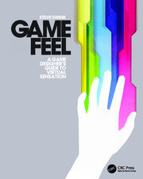
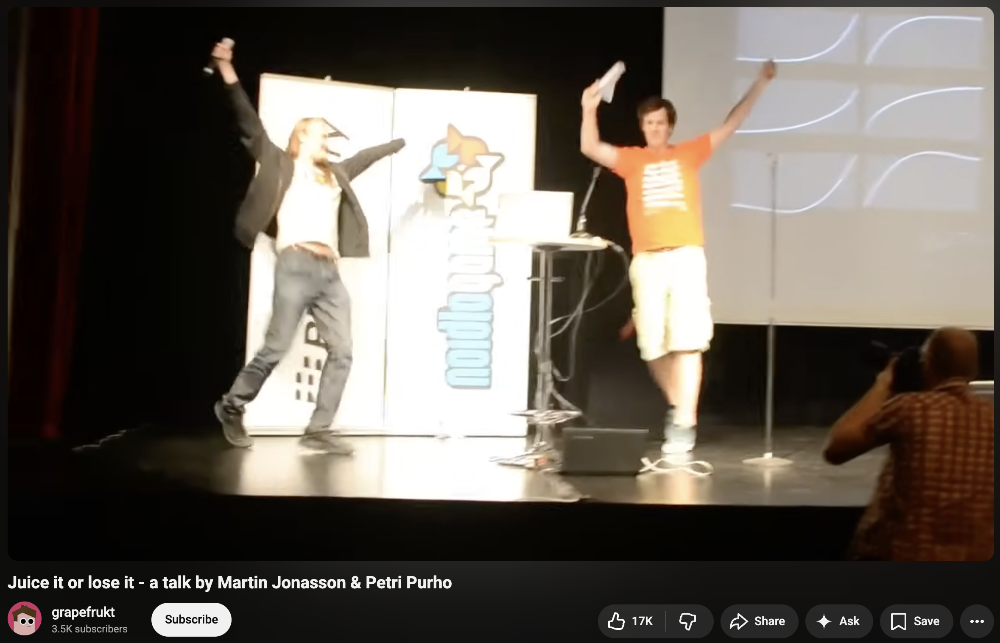
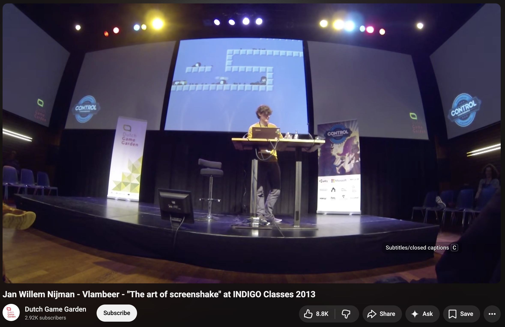
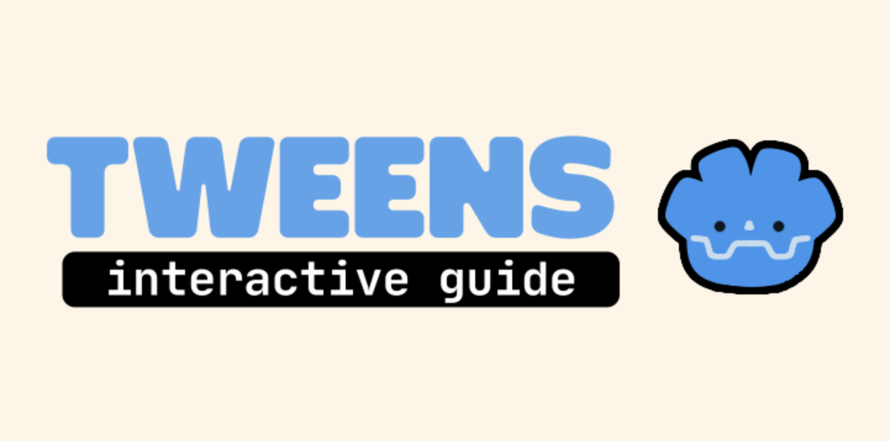

# Appendix — More Resources

There are approximately one _billion_ articles, videos and tweets about Juice. Every game dev content creator has something about it.

But if you want the most bang for your buck - I would call these the _essential texts_ on the subject. 

## [Game Feel — Steve Swink](http://www.game-feel.com/)

As far as I know, this is the OG in-depth exploration of the topic as a book. I could be _extremely_ wrong about that but until proven otherwise that is the claim I will make. 

It's an excellent guide to the topic and covers a lot of things we _didn't_ in this workshop. 

Probably the best way to build an informed intuition on the why, what and how of Game Feel. 

🔗 **[game-feel.com](http://www.game-feel.com/)** — companion site to the book *Game
Feel: A Game Designer's Guide to Virtual Sensation*.

## [Juice It or Lose It — Martin Jonasson & Petri Purho](https://www.youtube.com/watch?v=Fy0aCDmgnxg)

Similarly credited as one of the OG's, this talk is required watching if you have any doubts about the importance of Juice.

It's a fun talk with great examples! And a menu for turning all this stuff on and off as well which was (clearly) a big inspiration for this project. 

🔗 **[Juice It or Lose It — Martin Jonasson & Petri Purho](https://www.youtube.com/watch?v=Fy0aCDmgnxg)**

## [The Art of Screenshake — Jan Willem Nijman (Vlambeer)](https://www.youtube.com/watch?v=AJdEqssNZ-U)

Another extremely good case for Juice and how it works with super practical tips and tricks. In particular the format of this talk was an inspiration for this workshop (both in origin and in format).

Vlambeer had enormous impact on Juice and Game Feel in the indie scene and that's because they just had this stuff extremely dialed in.

🔗 **[The Art of Screenshake — Jan Willem Nijman (Vlambeer)](https://www.youtube.com/watch?v=AJdEqssNZ-U)**

# Also
While not about Juice _specifically_, this Godot Tween Guide is one of the best to ever do it. 

## [Godot Tween Guide](https://qaqelol.itch.io/tweens)

An _extremely_ cool interactive guide to `Tweens` in Godot by a developer and artist named: [Christophe](https://qaqelol.itch.io/). 

Hard to think of a better way to display the ease, power and versatility of the tool that will help you "10x the Juice in your game" as the YouTube thumbnails like to say. 

🔗 **[Godot Tween Guide by Christophe](https://qaqelol.itch.io/tweens)**

## 🍎 🍉 🍊 🍋 🍍 🥝 🫐 🍇

### [← Appendix — Git Help & FAQ](14-appendix-git-help.md) | [Table of Contents](00-contents.md)
